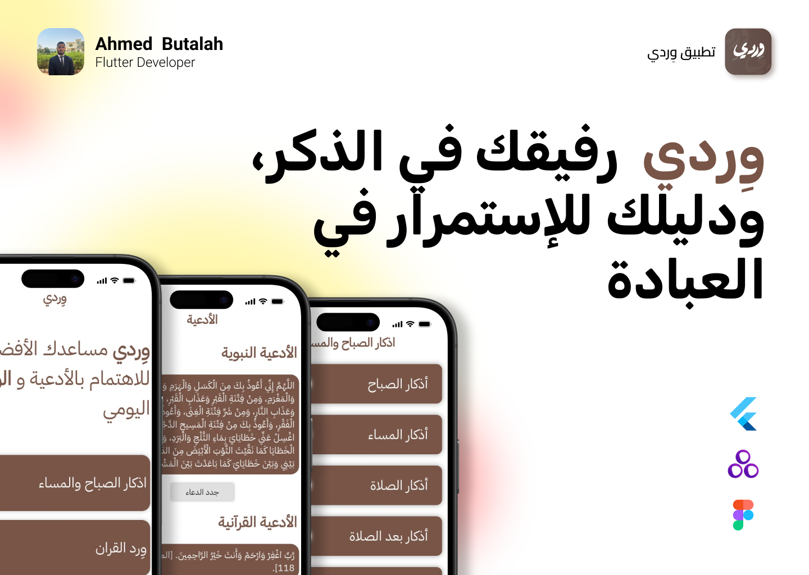

WerdiApp is a Flutter application that helps you track your daily Azkar & Werd with a simple and elegant interface.

🚀 How to Run

Clone the repository:

git clone https://github.com/Ahmedshrfee/WerdiApp.git

Navigate to the project:

cd WerdiApp

Get the dependencies:

flutter pub get

Run the app:

flutter run

✨ Features

Track daily Azkar and Werd.

Clean and simple UI.

Local storage with GetStorage.

Arabic language support.

📸 Screenshots

  
